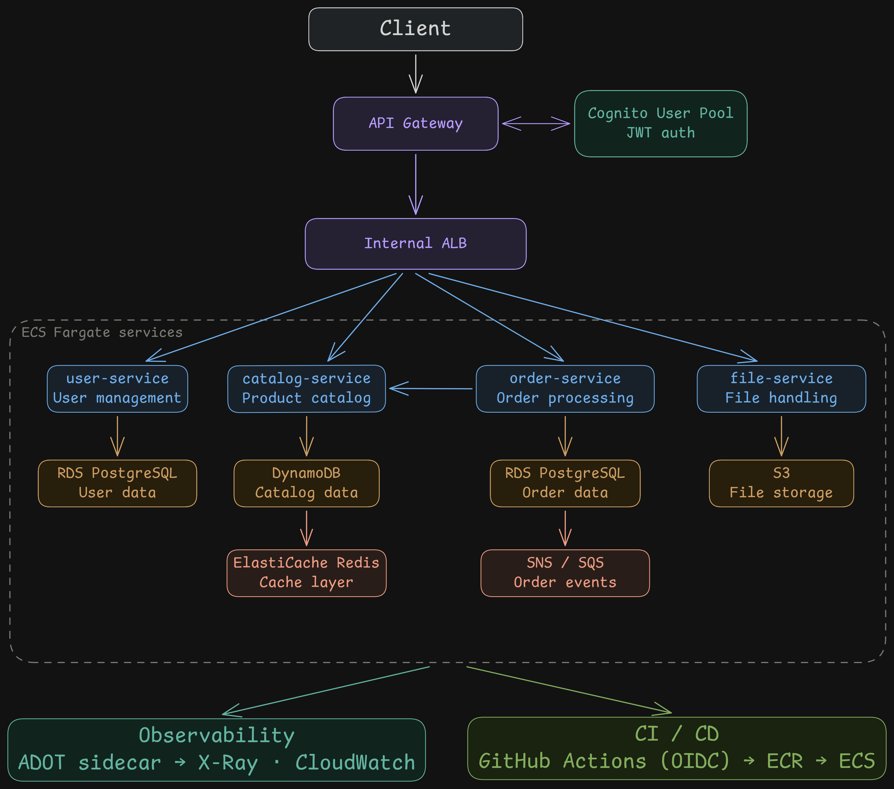

# AWS Microservices Portfolio

Four production-grade microservices on AWS ECS Fargate: user management, product catalog, order processing, and file uploads — connected via SNS/SQS async messaging and gRPC, with distributed tracing through X-Ray and zero-credential CI/CD via GitHub Actions OIDC.

[](https://github.com/mitaka-dev/aws-microservices-portfolio/actions/workflows/ci.yml)


## Architecture



## AWS Services Used

**Compute:** ECS Fargate, Lambda (health mock)  
**Networking:** VPC, API Gateway (HTTP API), Application Load Balancer, VPC Link, NAT Gateway, AWS Cloud Map  
**Auth:** Cognito User Pool, JWT authorizer, IAM OIDC provider  
**Storage:** RDS PostgreSQL, DynamoDB (on-demand), ElastiCache Redis, S3  
**Messaging:** SNS, SQS (with DLQ)  
**Observability:** X-Ray, CloudWatch Metrics, CloudWatch Logs, CloudWatch Dashboard, CloudWatch Alarms, ADOT (OpenTelemetry Collector), OTel Java agent  
**CI/CD:** ECR, GitHub Actions  
**IaC:** OpenTofu (Terraform-compatible) + Pulumi Java SDK 0.11.0 (parallel implementation), S3 remote state  
**Secrets:** AWS Secrets Manager  

## Quickstart

Prerequisites: AWS CLI, OpenTofu ≥ 1.8, Java 25, Docker.

```bash
# 1. Bring up the full stack (~5 min)
./scripts/up.sh

# 2. Create a test user and get a JWT
./scripts/get-token.sh

# 3. Call the API
BASE=$(tofu -chdir=infra/envs/dev output -raw api_gateway_endpoint)
BASE="${BASE%/}"
TOKEN="<paste token from step 2>"

curl "$BASE/health"
curl -H "Authorization: Bearer $TOKEN" "$BASE/catalog"
curl -s -X POST -H "Authorization: Bearer $TOKEN" \
     -H "Content-Type: application/json" \
     -d '{"name":"Widget","description":"A test item","price":9.99,"stock":100}' \
     "$BASE/catalog" | jq .

# 4. Run the full end-to-end test suite
./tests/e2e-aws.sh

# 5. Tear down when done
./scripts/down.sh
```

## Cost

| State | ~Cost | Main drivers |
|---|---|---|
| **Running** | ~$4/day | NAT Gateway $1.08/day · RDS t4g.micro $0.38/day · ElastiCache t4g.micro $0.38/day · ALB $0.19/day · ECS tasks ~$0.10/day |
| **Torn down** | ~$0.02/day | S3 state bucket + ECR image storage |

> Auto-scaling includes a scheduled scale-to-zero at 22:00 UTC and scale-up at 08:00 UTC to cut cost during inactivity.

## Architectural Tradeoffs

Honest assessment of what I'd change for a production system at real scale:

| Area | Portfolio choice | Production alternative | Reason to change |
|---|---|---|---|
| **Database** | RDS `db.t4g.micro`, single-AZ | Aurora PostgreSQL, multi-AZ, Serverless v2 | Automatic failover, storage auto-scaling, ~1/10 the ops surface |
| **Compute** | ECS Fargate | EKS + Karpenter | Better bin-packing, Spot support, richer ecosystem (Argo, KEDA) once you have >5 teams |
| **Service mesh** | Cloud Map DNS | App Mesh / Istio | mTLS between services, traffic splitting for canary deploys, circuit breaking at the mesh layer |
| **Edge security** | API GW throttling (500 RPS / 1000 burst) + WAF managed rules (OWASP Top 10) | Shield Advanced | Shield Advanced ($3k/month) adds dedicated support and L7 DDoS protection — overkill here; Shield Standard is free and already active |
| **Availability** | Single region | Active-active multi-region + DynamoDB global tables | Required for regulated industries or sub-100ms global latency targets |
| **Repo structure** | Monorepo | One repo per service | Team autonomy, independent deploy cadences, smaller CI blast radius |
| **Secrets rotation** | Secrets Manager, manual rotation | External Secrets Operator + HashiCorp Vault | Centralised rotation policies, audit trail, cloud-agnostic |

**Monorepo justification:** The four services share a `proto-shared` gRPC module; a monorepo makes cross-service proto changes and atomic refactors trivial. This becomes a coordination bottleneck once multiple teams own the services — the coupling is a feature here, and a smell at scale.

## Project Structure

```
aws-microservices-portfolio/
├── user-service/          Spring Boot 4, Flyway + RDS, Cognito JWT resource server
├── catalog-service/       DynamoDB single-table, Redis cache-aside, gRPC server :9090
├── order-service/         SNS/SQS, gRPC client → catalog, order state machine
├── file-service/          S3 presigned URLs (raw AWS SDK v2)
├── proto-shared/          Protobuf definitions + generated gRPC stubs (shared BOM)
├── infra/
│   ├── envs/dev/          OpenTofu root module (~180 resources, Phases 1–7)
│   └── modules/           Reusable modules: network, ecs-service, alb, rds, ...
├── infra-pulumi/          Pulumi Java SDK parallel IaC — same ~180 resources, 15 ComponentResources
├── .github/workflows/
│   ├── ci.yml             Test on PR · build+push+deploy on push to main (git-diff detection)
│   ├── infra.yml          tofu plan on infra/** PRs · tofu apply on dispatch
│   └── load-test.yml      k6 smoke on dispatch
├── scripts/
│   ├── up.sh              tofu plan + apply
│   ├── down.sh            tofu destroy
│   ├── get-token.sh       Cognito user creation + JWT
│   └── build-and-push.sh  Maven build + Docker multi-stage + ECR push
├── tests/
│   ├── e2e-local.sh       17-step integration test against Docker Compose stack
│   ├── e2e-aws.sh         Same suite against deployed AWS environment
│   └── load/              k6: smoke.js · scale.js (triggers auto-scaling) · order-flow.js
└── docs/
    ├── decisions/         Architecture Decision Records (ADRs 001–007)
    └── diagrams/          Architecture diagram source (.mmd)
```

## Running Tests

```bash
# Unit + integration tests (Testcontainers spins up Postgres, Redis, LocalStack)
./mvnw verify

# Single-service build
./mvnw -pl user-service -am verify

# Local end-to-end
docker compose up -d
./tests/e2e-local.sh

# k6 smoke against deployed AWS
BASE=$(tofu -chdir=infra/envs/dev output -raw api_gateway_endpoint)
TOKEN=$(./scripts/get-token.sh | grep 'eyJ' | head -1)
k6 run -e BASE_URL="${BASE%/}" -e TOKEN="$TOKEN" tests/load/smoke.js
```

## Architecture Decisions

See [`docs/decisions/`](docs/decisions/) for the full ADR set covering: Fargate vs EC2, API Gateway + ALB two-tier routing, Cloud Map vs service mesh, SNS/SQS vs RabbitMQ, monorepo structure, Maven multi-module, and Cognito vs self-issued JWT.
